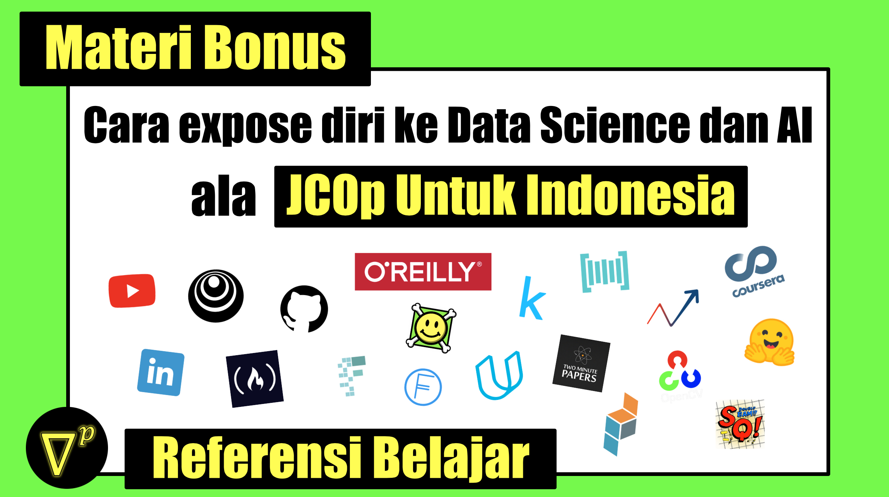

Video + commentary -> [cek di sini](https://youtu.be/PFxeqomOHxw)

# Pengantar 
Tentunya ilmu di dunia ini begitu luas dan [JCOp Untuk Indonesia](https://www.youtube.com/jcopuntukindonesia) hanyalah bekal untuk teman-teman bisa terbang lebih jauh. Itulah mengapa JCOp Untuk Indonesia percaya bahwa **membagikan referensi belajar juga merupakan sebuah materi**.

Setelah belajar secara komprehensif dan runut, mulai dari Pengantar Data Science ([Course 1](https://github.com/wiradkp/supervised_learning)), Fundamental Machine Learning ([Course 2-3](https://github.com/wiradkp/supervised_learning)), menghandle Unstructured Data ([Course 4](https://github.com/wiradkp/unstructured_data)), dan Deep Learning ([Course 5-6](https://github.com/wiradkp/deep_learning)). Sudah saatnya teman-teman untuk mengeksplor referensi belajar lainnya sesuai minat masing-masing.

Berikut adalah kompilasi referensi yang teman-teman dapat manfaatkan untuk mengekspose diri lebih jauh dengan bidang Data Science dan Artificial Intelligence

# Step 1: Follow LinkedIn berikut ini
- Update info, riset dan teknologi
    - [Analytics Vidya](https://www.linkedin.com/company/analytics-vidhya/)
    - [Deeplearning.ai](https://www.linkedin.com/company/deeplearningai/)
    - [Made with ML](https://www.linkedin.com/company/madewithml)
    - [Montreal.ai](https://www.linkedin.com/company/montreal.ai/)
    - [RASA](https://www.linkedin.com/company/rasa./)
    - [Towards AI](https://www.linkedin.com/company/towards-artificial-intelligence/)
    - [Vincent Boucher](https://www.linkedin.com/in/montrealai/)
- Head / Chief yang relate dengan DS atau AI
    - [Abishek Thakur](https://www.linkedin.com/in/abhi1thakur/)
    - [Alan Nichol](https://www.linkedin.com/in/anichol/)
    - [Dat Tran](https://www.linkedin.com/in/dat-tran-a1602320/)
    - [Nabih Ibrahim Bawazir](https://www.linkedin.com/in/nabihbawazir/) id
    - [Srivatsan Srinivasan](https://www.linkedin.com/in/srivatsan-srinivasan-b8131b/)
    - [Thomas Wolf](https://www.linkedin.com/in/thomas-wolf-a056857/)        
- Tips dan project ML (tapi juga jualan course)
    - [Adrian Rosebrock](https://www.linkedin.com/in/adrian-rosebrock-59b8732a/)
    - [Jason Brownlee](https://www.linkedin.com/in/jasonbrownlee/)
    - [Kevin Markham](https://www.linkedin.com/in/justmarkham/)
    - [Taufik Sutanto](https://www.linkedin.com/in/taufikedys/detail/recent-activity/shares/) id
- Other Indonesia related to follow
    - [Kata.ai](https://www.linkedin.com/company/kata-ai/) id
    - [Nodeflux](https://www.linkedin.com/company/nodeflux/) id
    - [Prosa.ai](https://www.linkedin.com/company/prosa-ai/) id
    - [Nobody](https://www.linkedin.com/in/wiradkputra/) id

# Step 2: Subscribe Youtube berikut
- Hiburan dan hal keren menggunakan AI
    - [carykh](https://www.youtube.com/user/carykh)
    - [Code Bullet](https://www.youtube.com/channel/UC0e3QhIYukixgh5VVpKHH9Q)
    - [Code Parade](https://www.youtube.com/channel/UCrv269YwJzuZL3dH5PCgxUw)
    - [OpenAI](https://www.youtube.com/channel/UCXZCJLdBC09xxGZ6gcdrc6A)
    - [Two minute papers](https://www.youtube.com/user/keeroyz)
- Belajar statistik, math, ML, dll
    - [Brandon Rohrer](https://www.youtube.com/user/BrandonRohrer)
    - [CodeEmporium](https://www.youtube.com/channel/UC5_6ZD6s8klmMu9TXEB_1IA)
    - [Deeplearning.ai](https://www.youtube.com/channel/UCcIXc5mJsHVYTZR1maL5l9w)
    - [JCOp Untuk Indonesia](https://www.youtube.com/jcopuntukindonesia) id
    - [Kaggle](https://www.youtube.com/user/kaggledotcom)
    - [Leo Isikdogan](https://www.youtube.com/channel/UC-YAxUbpa1hvRyfJBKFNcJA/videos)
    - [Luis Serrano](https://www.youtube.com/channel/UCgBncpylJ1kiVaPyP-PZauQ)
    - [StatQuest with Josh Starmer](https://www.youtube.com/user/joshstarmer)
- Belajar practical Data science dan AI
    - [Abishek Thakur](https://www.youtube.com/user/abhisheksvnit)
    - [AIEngineering](https://www.youtube.com/channel/UCwBs8TLOogwyGd0GxHCp-Dw)
    - [Datatalks](https://www.youtube.com/channel/UCQTQ0AbOupKNxKKY-_x46OQ)
    - [Sentdex](https://www.youtube.com/user/sentdex)
- Bahasan berat (paper, math, dll)
    - [ArXiv Insights](https://www.youtube.com/channel/UCNIkB2IeJ-6AmZv7bQ1oBYg)
    - [Henry AI Labs](https://www.youtube.com/channel/UCHB9VepY6kYvZjj0Bgxnpbw)
    - [HuggingFace](https://www.youtube.com/channel/UCHlNU7kIZhRgSbhHvFoy72w)
    - [INACL Malkin](https://www.youtube.com/channel/UC4O5LY9sYN25M1oBTsqGSIw/featured) id
    - [Krishna D N](https://www.youtube.com/channel/UC0AaMZ3TbGRExfM2Eq-qZ5g)
    - [Pieter Abbeel](https://www.youtube.com/user/pabbeel/)
    - [Yannic Kilcher](https://www.youtube.com/channel/UCZHmQk67mSJgfCCTn7xBfew)
- Seminar gratis, dan podcast
    - [Bisa.ai](https://www.youtube.com/channel/UCGOi_aO_pEkDYs8uSJduP6w/videos) id
    - [Deepmind](https://www.youtube.com/channel/UCP7jMXSY2xbc3KCAE0MHQ-A)
    - [Lex Fridman](https://www.youtube.com/user/lexfridman)
    - [PyData](https://www.youtube.com/channel/UCOjD18EJYcsBog4IozkF_7w)
    - [PyTorch](https://www.youtube.com/channel/UCWXI5YeOsh03QvJ59PMaXFw)
- Belajar dalam x jam
    - [Derek Banas](https://www.youtube.com/channel/UCwRXb5dUK4cvsHbx-rGzSgw)
    - [freecodecamp](https://www.youtube.com/channel/UC8butISFwT-Wl7EV0hUK0BQ)

# Step 3: Bahan Bacaan
- Non Publikasi Ilmiah
    - [analyticsvidhya](http://analyticsvidhya.com/)
    - [FloydHub Blog](https://blog.floydhub.com)
    - [Hackernoon](https://hackernoon.com)
    - [machinelearningmastery](https://machinelearningmastery.com)
    - [mlfromscratch](https://mlfromscratch.com)
    - [pyimagesearch](https://www.pyimagesearch.com/)
    - [Tau Data](https://tau-data.id) id
    - [Towards Data Science](https://towardsdatascience.com)
    - [ycombinator](https://news.ycombinator.com/news)
- Publikasi Ilmiah (paper)
    - [arXiv](https://arxiv.org)
    - [Papers with Code](https://paperswithcode.com)
    - [State of the Art AI](https://www.stateoftheart.ai)

# Step 4: Course Online
- Gratis
    - [Coursera](https://www.coursera.org)
    - [EdX](https://www.edx.org)    
    - [fast.ai](http://fast.ai)
    - [JCOp untuk Indonesia](http://youtube.com/JCOpUntukIndonesia) id
    - [Kaggle Learn](https://www.kaggle.com/learn/overview)
    - [mlcourse.ai](https://mlcourse.ai)
- Berbayar
    - [Datacamp](http://datacamp.com)
    - [PacktPub](https://www.packtpub.com)
    - [Pluralsight](http://pluralsight.com)    
    - [Udacity](http://udacity.com)
    - [Udemy](http://udemy.com)

# Step 5: Recommended Book
- [Introduction to Statistical Learning - Trevor Hastie](https://link.springer.com/book/10.1007/978-1-4614-7138-7)
- [Element of Statistical Learning - Trevor Hastie](https://web.stanford.edu/~hastie/Papers/ESLII.pdf)
- [Forecasting: Principles and Practice - Hyndman & Athanasopoulos](https://otexts.com/fpp2/)
- [Buku-buku oreilly](https://www.safaribooksonline.com)
    - [Hands on machine learning with sklearn keras tensorflow](https://learning.oreilly.com/library/view/hands-on-machine-learning/9781491962282/)
    - [Deep Learning with Python](https://learning.oreilly.com/library/view/deep-learning-with/9781617294433/)
    - [Machine learning with python - Andreas g muller](https://learning.oreilly.com/library/view/introduction-to-machine/9781449369880/)
- [Deep Learning - Ian Goodfellow](https://www.google.com/search?client=safari&rls=en&q=deep+learning+ian+goodfellow&ie=UTF-8&oe=UTF-8)
- [Grokking Machine Learning - Andrew Trask](https://www.manning.com/books/grokking-machine-learning)
- [Grokking Deep Learning - Andrew Trask](https://www.manning.com/books/grokking-deep-learning)
- [Python Data science handbook](https://jakevdp.github.io/PythonDataScienceHandbook/)

# Step 6: Komunitas di Indonesia
- [Artificial Intelligence Indonesia](https://artificialintelligence.id) id
- [Big Data Indonesia / Data Engineering Indonesia](https://t.me/bigdataID) id
- [Business Intelligence Indonesia](https://t.me/businessintelligenceID) id
- [Data science Indonesia (DSI)](https://datascience.or.id) id
- [Jakarta Machine Learning (JML)](https://jakartamachinelearning.com) id
- [Machine Learning Indonesia (MLID)](https://t.me/machinelearningid) id
- [Natural Language ID](https://t.me/nlp_lounge) id
- [Python Indonesia (Python ID)](https://t.me/pythonid) id
- [PyTorch Indonesia](https://t.me/pytorchid) id

# Tips lainnya untuk mendapatkan referensi belajar
- Eksplor repository peserta yang mendapatkan beasiswa. Misalnya [kompilasi ini](https://airtable.com/shrwVC7gPOuTJkxW0/tblUf4zxlIMLjwrbv) yang dirangkum oleh peserta beasiswa Udacity.
- Sebagai programmer, kita suka menggunakan kata kunci `awesome` ketika membuat repository yang sifatnya kurasi / kompilasi. Misalnya:
    - [awesome-pytorch-list](https://github.com/bharathgs/Awesome-pytorch-list)
    - [awesome-machine-learning](https://github.com/josephmisiti/awesome-machine-learning)
    - [awesome-dataviz](https://github.com/fasouto/awesome-dataviz)
    - [awesome-nlp](https://github.com/keon/awesome-nlp)

# Dari JCOp, Untuk Indonesia :heart:
Terima kasih yang telah membaca. Semoga kompilasi ini dapat bermanfaat untuk rekan-rekan saya di seluruh Indonesia. 
n.b. Kompilasi ini merupakan sebuah rekomendasi pribadi dan dapat bersifat subjektif.

Last updated: 5 Juni 2020